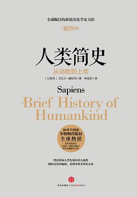

> *Fabula* means *story*, which is a topic in *A brief history of humankind*

### 简史三部曲

- **A brief history of humankind**
- **Homo Deus：A Brief History of Tomorrow**
- **21 Lessons for the 21st Century**

    
 
         
    

    

         
    

    

         
    

从史前到未来，再回到21世纪的旅行，有各种各样的**意义之网**。

### To Kill a Mocking Bird

>   “依然是夏天，孩子们走近了。男孩身后拖着根鱼竿踯躅不前。一个男人双手叉腰站在那里等他。夏天，他的孩子们在前院和朋友玩耍，自编自演着他们古怪的小话剧。
> 
>   秋天，他的孩子们在杜博斯太太房前的人行道上打架。男孩扶着他妹妹站起来，过后他们一起走回家去。秋天，他的孩子们小跑着来回经过那个街角，每天的苦恼和得意都写在脸上。他们在橡树前停下了，表情又欣喜又困惑，还带着忧虑。
>
>   冬天，他的孩子们在院门前哆嗦着，黑色的剪影衬着熊熊燃烧的房屋。冬天，那男人走上街头，扔下眼镜，射死了一只疯狗。
> 
>   夏天，他眼看着他的孩子们心碎了。又到了秋天，怪人的孩子们需要他了。”

### 进化心理学

从人类进化以适应生存问题的角度解释人类的行为。

### 饮食的思迷

以摄入的能量等指标来衡量也可能并不合理，即使是相同的东西在不同人身上也会有不同的效果。我们不得不考虑微生物在这一过程中的
影响。虽然很多东西还不能得以解释，但总之多样性应该是对的。