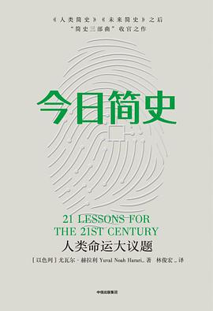

> *Fabula* means *story*, which is a topic in *A brief history of humankind*

### 简史三部曲

- **A brief history of humankind**
- **Homo Deus：A Brief History of Tomorrow**
- **21 Lessons for the 21st Century**

    
 
         
    

    

         
    

    

         
    

从史前到未来，再回到21世纪的旅行，有各种各样的**意义之网**。