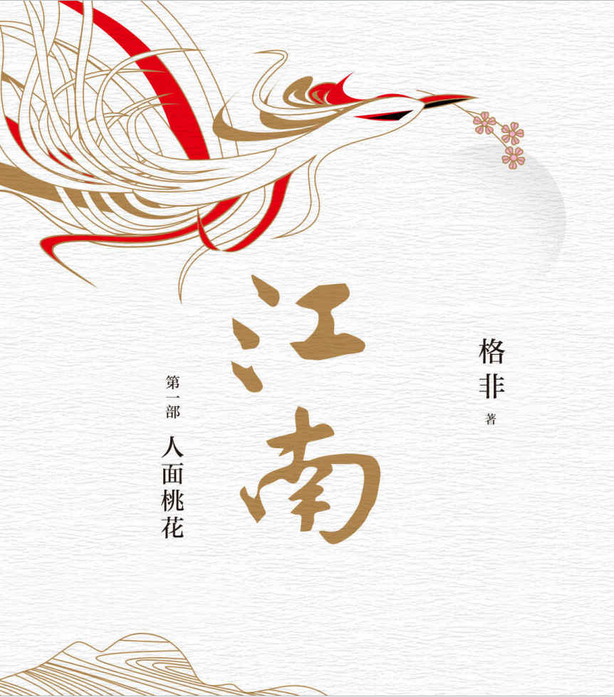
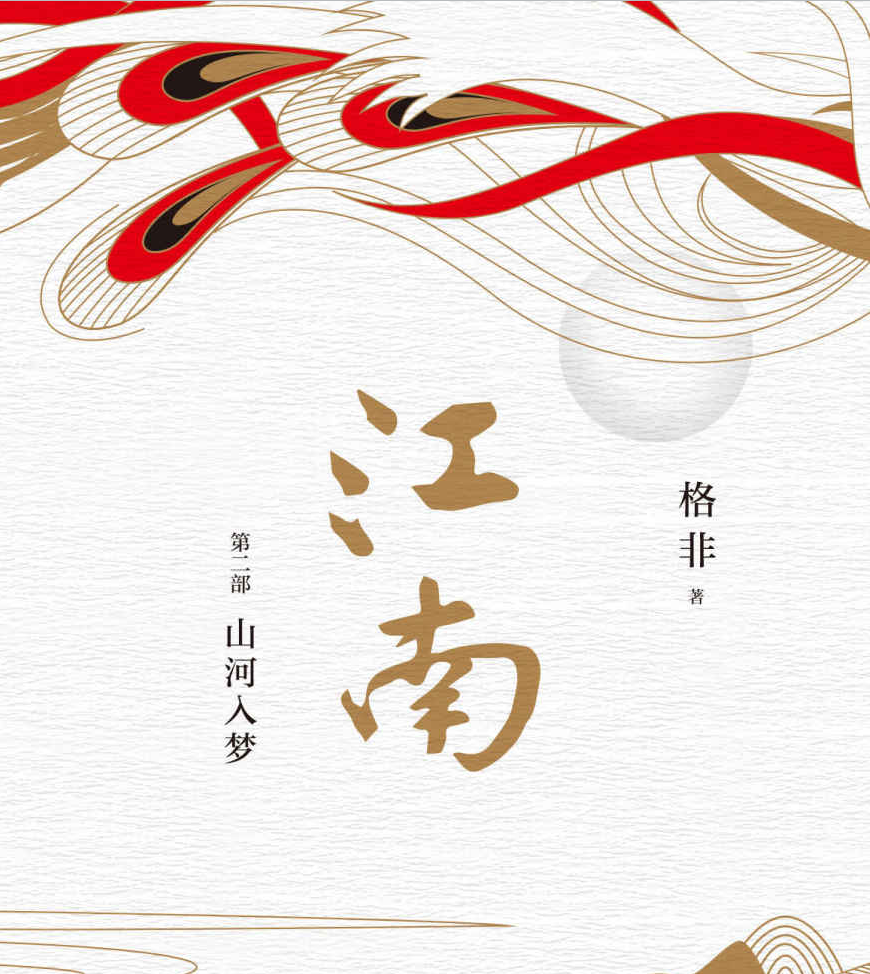
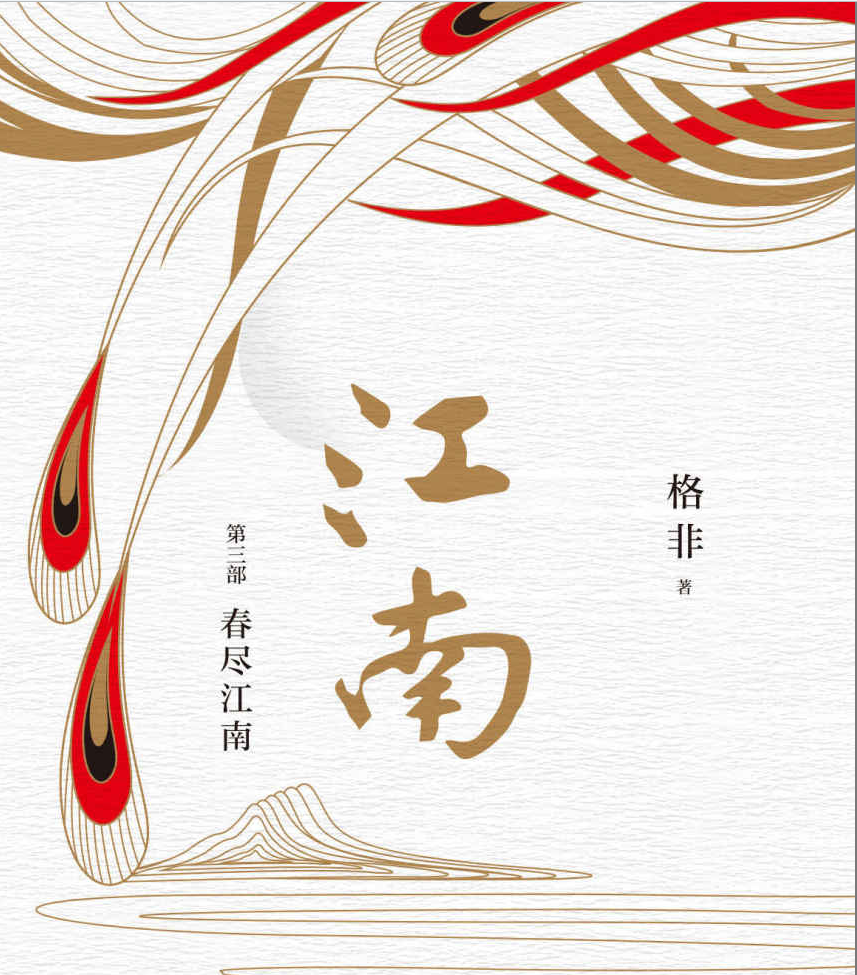

### 繁花

描绘上海20世纪60年代至90年代市民生活，字里行间洋溢着上海话的风格。

### 江南三部曲

    
 
         
    

    

         
    

    

         
    

理想与现实，最终以别样方式的和解。

### 毛泽东传

毛泽东，无产阶级革命的领导者，有着强烈的民族主义精神和斗争精神，
带领军队从井冈山走遍祖国大江南北，最终夺取统治权，在此期间作为一个诗人，
抒发对山河的感叹，洋溢着激情和傲气，“是风流人物还看今朝”。
在晚年，成为“半神半人式的人物”，“集真理和权力于一身”，
而中国政治局势则左右摇摆，处于各种混沌之中。

> “如果我们今天不反对新八股和新教条主义，”
> 毛泽东在延安批评28个布尔什维克时曾说，“则中国人民的思想又将受另一种形式主义的束缚。”

Anyway, 毛主席还是非常伟大的，真正地改变了历史进程。

### 物理学家的智性冒险

在一篇篇简短的随笔的背后，是一个物理学家的热忱的心与深邃而广泛的思考。科学的发展，似乎呈现着一种连续性，古今之间的伟大思想彼此相连。

### 经济学原理：微观经济学分册

开拓新大陆——「经济学」！