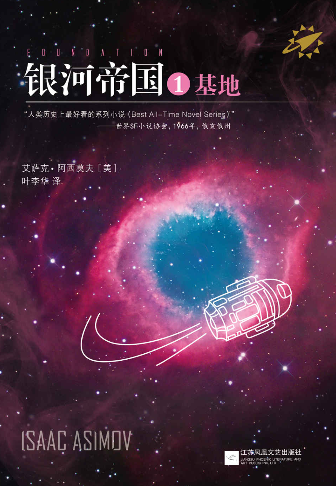
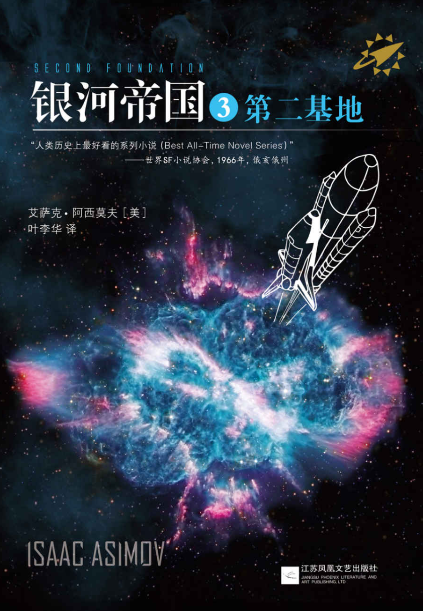

### 凯尔特神话全书 & 北欧神话全书

    
 
         
    

    

         
    

欧洲神话体系三大支柱之二——凯尔特神话，北欧神话。

### 英国简史

英国历史的略缩图——从史前时代到现代，从罗马时代到维多利亚时代，从亨利八世到伊丽莎白二世，从工业革命到现代化，从帝国到联邦，从世界霸主到欧洲一员。

### 1984

老大哥在看着你，面带微笑的尊容逐渐浮现在你的眼前，你的脑海中回荡着党的口号——「战争即和平，自由即奴役，无知即力量」。

### 献给阿尔吉侬的花束

“这是否表示我想洗净自己的罪恶？想获得重生？这是洗礼的象征吗？或是我们修脸修得太短了？一个白痴（idiot）还会有本我（id）吗？”

### 古罗马帝国的辉煌

“用火与剑来征服世界，用路与法来治理万邦”

### 平面国

妙趣横生的二维世界，对于高维空间的描述生动而形象。

### 欧洲中世纪史

一本不错的欧洲中世纪史概览，从多个角度——神权、王权、教会、城市、经济、文化等——来理解中世纪的欧洲。

### 银河帝国 —— 基地三部曲

    
 
         
    

    

         
    

    

        
    

时隔多年再读基地三部曲，融合多种元素的经典，银河帝国折射着古罗马帝国的辉煌与衰落，心理史学综合数学与历史，第二基地是对构建社会体系的思考。