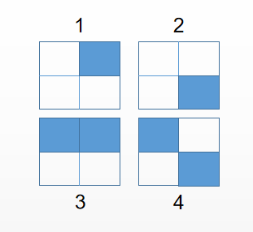
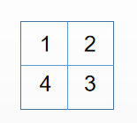
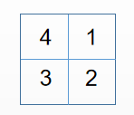
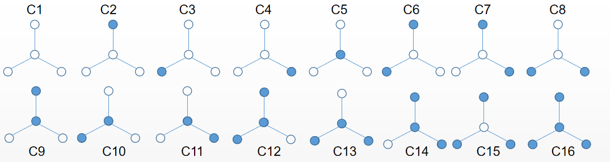

# Polya计数

>将波利亚计数定理整理在这里，作为一个总结和介绍，也方便以后复习

**为什么学习Polya计数定理**  

 通过Polya计数定理，我们可以计算等价类的数量，比如下面这个问题：

 *用$m$种颜色给一个正方形染色，如果正方形可以自由转动，求染色方案数*

>让我们从一些概念开始
## 1 等价关系

### 1.1 等价关系的定义

假设$V$是一个集合，$S$是定义在$V$上的一个关系，若$S$有如下性质：

- 自反性
- 传递性
- 对称性
  
那么， $S$就是一个等价关系    

$a$和$b$有关系$S$,可以记为$aSb$

>假设定义关系$S$，图形$a$可以旋转得到$b$ $\Leftrightarrow$ $aSb$  
例如图中的$方块_1$和$方块_2$具有关系$S$，即他们可以通过旋转得到彼此，而$方块_1$和$方块_2$则没有关系$S$  

### 1.2 等价类

通过上图，可以看出来：$方块_1$和$方块_2$是同一类的，而$方块_1$和$方块_2$则是另外两类，于是可以想到集合$V$上的等价关系$S$将集合的元素划分到不同的类中，我们把它称为等价类

而包含元素$a$的等价类则是由满足$aSb$的所有元素$b$组成的(当然也包含元素$a$),即$C(a)=\{b\in V | \ aSb\}$

仔细想一想，不难发现**两个不同等价类是不相交的**

## 2 置换群

### 2.1 置换群的定义

假设$A=\{1,2,\dotsc, n\}$，通过置换，将$A$中的元素重新排列，得到另一个排列$a_1, a_2, \dotsc, a_n$，可以把这个过程写成

$$
\left (
    \begin{matrix}
       1 & 2 & \dotsc & n \newline
       a_1 & a_2 & \dotsc & a_n
    \end{matrix}
\right )
$$

所以，可以将置换看成一个双射函数$f:\{1,2,\dotsc, n\} \rightarrow \{1,2,\dotsc, n\}$

置换之间也可进行**合成**运算
>$$ 
\pi_1 = \left ( 
    \begin{matrix}
        1 & 2 & 3 & 4 \newline
        4 & 2 & 1 & 3
    \end{matrix}
    \right ) \ \ 
\pi_2 = \left ( 
    \begin{matrix}
        1 & 2 & 3 & 4 \newline
        2 & 1 & 4 & 3
    \end{matrix}
    \right ) 
>$$  
>$$
 \pi_1 \circ \pi_2 =\left ( 
    \begin{matrix}
        1 & 2 & 3 & 4 \newline
        2 & 4 & 3 & 1
    \end{matrix}
    \right ) 
>$$
>$\pi_1 \circ \pi_2 (1) = \pi_1(\pi_2(1))=2$
 
而在置换集合$X$上定义的群则称为置换群，置换群也是群也要满足群的性 质  

- 运算封闭 $\pi_1 \in X, \pi_2 \in X \Rightarrow \pi_1 \circ \pi_2 \in X$
- 满足结合律
- 有单位元，置换$I(a)=a$
- 有逆元，$\pi \circ \pi^{-1} = I$

但是置换与计算不同染色模式数量有什么关系？图形的旋转等变换都可以用一个只置换来表示

我们把1-4按顺时针放到正方形的四个方块中

>  
$\pi_1=\left(\begin{matrix}
    1 & 2 & 3 & 4 \newline
    1 & 2 & 3 & 4
\end{matrix}\right)$

旋转$90^\circ$

>
$\pi_2=\left(\begin{matrix}
    1 & 2 & 3 & 4 \newline
    4 & 1 & 2 & 3
\end{matrix}\right)$

### 2.2 置换群衍生的等价关系

假设$G=(X,\circ)$，通过置换$\pi\in X$，元素$a$可以被置换为其他元素$\pi(a)=b$，可以发现这里也存在一种等价关系， 可以定义等价关系$S$:

$$
    aSb \Leftrightarrow \exist \pi \in G, \pi(a)=b
$$
> $\pi \in G 也可以来表示 \pi \in X$  

而包含$a$的等价类$C(a)$是由所有满足$aSb$的元素$b$组成的，因此我们也可以说
$$
    C(a)=\{\pi(a) \ | \ \pi \in G\}
$$

>如果$A=\{1,2,3\}$  
$\pi_1=\left(\begin{matrix}
    1  & 2 & 3  \newline
    1 & 2 & 3 
\end{matrix}\right)$  
$\pi_2=\left(\begin{matrix}
    1 & 2 & 3 \newline
    3 & 2 & 1 
\end{matrix}\right)$  
$X=\{\pi_1, \pi_2\}$,可以验证$G=\{X,\circ\}$是一个置换群，$\{1,3\}$是一个等价类，$\{2\}$是一个等价类

可以证明自反、对称、传递是满足的

## 3 伯恩赛德引理
> 这个定理将给出置换群衍生出的等价关系的（不同）等价关系数量的计数方法

### 3.1 伯恩赛德引理

*假设$G$是一个置换群，$a$是$A$中的元素，如果$\pi(a)=a$，则称$A$中的元素$a$在置换$\pi$下是**不变的**(Invariant)，$Inv(\pi)$表示不变元素的数量*

**定理** &nbsp; 假设$G$是一个集合$A$的置换群，设$S$是$G$上衍生出来的等价关系，那么$S$中的等价类的数量由下式给出:

$$
\frac{1}{|G|} \sum_{\pi\in G}Inv(\pi)
$$

$|G|$是置换群中置换的数量，让我们来用一下这个定理，假设$G$下面的置换组成

$$
   \pi_1=\left(\begin{matrix}
    1  & 2 & 3  & 4\newline
    1 & 2 & 3 & 4
    \end{matrix}\right) ,
    \pi_2=\left(\begin{matrix}
    1  & 2 & 3 & 4 \newline
    2 & 1 & 3 & 4
\end{matrix}\right) ,
$$

$$
\pi_3=\left(\begin{matrix}
    1  & 2 & 3  & 4\newline
    1 & 2 & 4 & 3
    \end{matrix}\right) ,
    \pi_4=\left(\begin{matrix}
    1  & 2 & 3 & 4 \newline
    2 & 1 & 4 & 3
\end{matrix}\right) ,
$$

可以看出来，有两个等价类分别是$\{1,2\}$，$\{3, 4\}$，等价类的数量为$2$

可以验证$Inv(\pi_1)=4,Inv(\pi_2)=2,Inv(\pi_3)=2,Inv(\pi_4)=0$

$$
等价类的数量=\frac{1}{4}(4+2+2+0)=2
$$

### 3.2 伯恩赛德引理的证明

#### Part 1

*这个证明可以跳过，对后面阅读没有什么影响*

对于$A$中的元素$a$，我们可以定义**稳定算子**(Stabilizer)的概念，$St(a)$是保持元素$a$不变的置换的集合，$St(a)=\{\pi \in G | \pi(a) = a\}$，

>$$
   \pi_1=\left(\begin{matrix}
    1  & 2 & 3 \newline
    1 & 2 & 3
    \end{matrix}\right) ,
    \pi_2=\left(\begin{matrix}
    1  & 2 & 3 \newline
    2 & 3 & 1 
\end{matrix}\right) , 
\pi_3=\left(\begin{matrix}
    1  & 2 & 3  \newline
    3 & 1 & 2
    \end{matrix}\right) ,
>$$
>$St(2) = \{\pi_1\}$，  
包含$2$的等价类$C(2)=\{\pi_1(2),\pi_2(2),\pi_3(2)\}=\{1, 2, 3\}$

可以发现$|St(2)| \times |C(2)| = |G| = 3$，这不是巧合

**引理** &nbsp; 假设$G$是一个置换群，而且$a \in A$，那么，
$$
    |St(a)| \times |C(a)| = |G|
$$

让我们来简单证明这个定理

假设$C(a)=\{b_1,b_2,\dotsb, b_r\}$，那么存在一个$\pi_1$，满足$\pi_1(a)=b_1$，同样存在$\pi_2(a)=b_2$,$\dotsb$,设$P=\{\pi_1, \pi_2, \dotsc, \pi_r\}$，而且$|P|=|C(a)|$，于是转化为证明$|St(a)|\times |P|=|G|$

从$G$中选一个置换$\pi$, $\pi$一定将$a$置换成一个元素，设该元素为$b_k$，即$\pi(a)=b_k$，

另一个方面，$\pi_k(a)=b_k$,因此$\pi^{-1}_k \circ \pi(a)=a$，即$\pi^{-1}_k \circ \pi \in St(a)$，

$$
\pi_k \circ (\pi_k^{-1} \circ \pi) = \pi
$$
这说明$G$中的元素$\pi$可以由$St(a)$和$C(a)$中的元素合成得到

然后我们再来说明这是唯一的

假设$\pi=\pi_k\circ \gamma=\pi_l \circ \delta$ ，$\gamma$和$\delta$都在$St(a)$中，因此$\pi_k \circ \gamma(a)=b_k=\pi_l \circ \delta (a)=b_l$，因此$l=k$，这种组合方式是唯一的，因此$|St(a)| \times |C(a)| = |G|$

#### Part 2

让我们继续证明伯恩赛德引理

假设$A=\{1,2,\dotsc,n\}$, $G=\{\pi_1, \pi_2, \dotsc, \pi_m\}$，让我们看看下面这个式子的是否成立

$$
|Inv(\pi_1)|+|Inv(\pi_2)|+\dotsb+|Inv(\pi_m)|=|St(1)|+|St(2)|+\dotsb+|St(n)|
$$

可以发现都计数的是满足$\pi(a)=a$序对$<\pi,a>$的个数，因此等式是成立的

将等式两边同时除以|G|，左边就得到了伯恩赛德引理的型式，而右边，根据**Part1**中的引理可以转化为

$$
\frac{1}{C(1)}+\frac{1}{C(2)}+\dotsb+\frac{1}{C(n)} \ \ \ \ (1)
$$

而$C(a)$是一个等价类，两个等价类的交集要么是全集要么是空集，假设$C(a)=\{b_1,b_2,\dotsc, b_r\}$,那么，

$$
\frac{1}{C(b_1)}+\frac{1}{C(b_2)}+\dotsb+\frac{1}{C(b_r)}=\frac{1}{r}+\frac{1}{r}+\dotsb+\frac{1}{r}=1
$$

于是(1)式计数的就是等价类的个数

## 4 等价着色

伯恩赛德引理和计算等价着色数量有什么关系呢?其实伯恩赛德引理不能直接帮助我们计算等价着色的数量，但是我们可以适当的定义等价关系，然后再计算等价着色的数量

假设$C(R,D)$使用$R$中的颜色，来给$D$中的元素染色的着色集合，

>假设$R$是黑色和白色，$D$是图中的节点，那么$C(R,D)$是给图中节点染色的集合

>$C(R,D)=\{C_1,C_2,\dotsb, C_{16}\}$

定义在$C(R,D)$上的置换$\pi^*$，将一种着色变为另一种着色，更形式一点，假定$f$是一个着色，那么新着色$\pi^*f$定义为$(\pi^*f)(a)$是$f(\pi(a))$

同样，也可以定义$C(R,D)$上的置换群，$G^*=\{\pi^* \ | \ \pi \in G\}$，$G$和$G^*$的元素数量一样，因为$\pi$和$\pi^*对应于一种相同旋转$。$G^*$也可以衍生出等价关系$S^*$，而$S^*$就是我们关注的。

假设$f,g$是两个着色，如果有一个$\pi \in G$($\pi^*\in G^*$)，$\pi^*f=g$，我们就认为$f,g$是等价的

我们要求的$S^*$划分出来的等价类的数量

从上图可以看出来$G^*$的大小是$3$，设$G^*=\{\pi_1^*,\pi_2^*,\pi_3^*\}$，分别对应逆时针旋转$0^\circ,120^\circ, 240^\circ$

$$
\pi_1^*=\left(\begin{matrix}
    C_1 & C_2 & C_3 & C_4 &C_5 & C_6 &C_7 & C_8 &C_9 & C_{10} & C_{11} & C_{12} & C_{13} & C_{14} & C_{15} & C_{16} \newline
   C_1 & C_2 & C_3 & C_4 &C_5 & C_6 &C_7 & C_8 &C_9 & C_{10} & C_{11} & C_{12} & C_{13} & C_{14} & C_{15} & C_{16} 
\end{matrix}\right)
$$

$$
\pi_2^*=\left(\begin{matrix}
    C_1 & C_2 & C_3 & C_4  &C_5 & C_6 &C_7 & C_8 &C_9 & C_{10} & C_{11} & C_{12} & C_{13} & C_{14} & C_{15} & C_{16} \newline
   C_1 & C_3 & C_4 & C_2  &C_5 & C_8 &C_6 & C_7 &C_{10} & C_{11} & C_{9} & C_{13} & C_{14} & C_{12} & C_{15} & C_{16} 
\end{matrix}\right)
$$

$$
\pi_3^*=\left(\begin{matrix}
    C_1 & C_2 & C_3 & C_4 &C_5 & C_6 &C_7 & C_8 &C_9 & C_{10} & C_{11} & C_{12} & C_{13} & C_{14} & C_{15} & C_{16} \newline
   C_1 & C_4 & C_2 & C_3 &C_5 & C_7 &C_8 & C_6 &C_{11} & C_{9} & C_{10} & C_{14} & C_{12} & C_{13} & C_{15} & C_{16} 
\end{matrix}\right)
$$

$Inv(\pi_1^*)=16,Inv(\pi_2^*)=4,Inv(\pi_2^*)=4$

根据伯恩赛德引理，

$$
等价着色的个数=\frac{1}{3}(16+4+4)=8
$$
可以从上图中验证这个结果的正确性，为了与$S$中的等价类区分，我们称$S^*$中等价类为**模式**

*通过枚举$C(R,D)$中的元素，再枚举$\pi^*$计算$Inv(\pi^*)$过于麻烦，可以直接计算$Inv(\pi^*)$，于是有了下面的定理*

## 5 Polya定理的特殊情况

### 5.1 循环分解

让我们再回到置换，设置换$\pi_1=\left(\begin{matrix}
    1 & 2 & 3 & 4 & 5\newline
    2 & 3 & 4 & 5 & 1 
\end{matrix}\right)$
让我们不断地重复这个置换，那么可以找到循环节$1\rightarrow 2 \rightarrow 3 \rightarrow 4 \rightarrow 5 \rightarrow 1$，那我们就把$\pi$简写$(12345)$

再比如$\pi_2=\left(\begin{matrix}
    1 & 2 & 3 & 4 & 5 & 6 \newline
    5 & 1 & 6 & 3 & 2 & 4
\end{matrix}\right)$
可以简写成$(152)(364)$，这一过程被称为循环分解

定义$cyc(\pi)$是$\pi$循环分解中循环节的数量，比如$cyc(\pi_1)=1，cyc(\pi_2)=2$

### 5.2 Polya 计数的特殊情况

**定理** &nbsp; 假设$G$是集合$D$的置换群，且$C(R,D)$是使用$R$中颜色给$D$中元素染色的集合，$R$中颜色的数量的$m$,$C(R,D)$中不同着色数量($S^*$中等价类的数量)由下式给出：

$$
\frac{1}{|G|} (m^{cyc(\pi_1)}+m^{cyc(\pi_2)}+\dotsb+m^{cyc(\pi_k)})
$$
其中$G=\{\pi_1, \pi_2, \dotsb, \pi_k\}$

>让我们用这个定理再算一次等价着色的个数，假定将中间的点记为$1$号
>
>$0^\circ旋转，\pi_1=(1)(2)(3)(4)$  
$120^\circ， \pi_2=(1)(234)$  
$240^\circ， \pi_3=(1)(234)$  
>
>$$
>等价着色的个数=\frac{1}{3}(2^4+2^2+2^2)=8
>$$

### 5.3 循环指标$P_G$

如果可以用一个生成函数来描述一个置换群，那将很有用，这将引出更一般的波利亚计数定理，因此有了循环指标$P_G$的概念

假设$\pi=(1)(23)(45)(6)(789)(10)$，可以将他编码为$x_1^3x_2^2x_3$

可以看出来编码方式，$x_i$代表长度为$i$的循环节，$x_i$的幂次$b$代表有多少个长度为$i$的循环节

于是可以用每个置换编码的和再除以$|G|$,

$$
P_G(x_1,x_2,\dotsc,x_k)=\frac{1}{G}\sum_{\pi\in G} x_1^{b_1}x_2^{b_2}\dotsb x_k^{b_k}
$$
来编码一个置换群

对5.2的例子中的置换群进行编码，$P_G=\frac{1}{3}(x_1^4+x_1x_3+x_1x_3)$

而且，波利亚计数的特殊情况就是$P_G$中$x_1,x_2,\dotsc,x_k$都取$m$的情况

### 5.4 Polya计数特殊情况的证明

*同样可以跳过这一部分*

将Polya计数特殊情况的公式与伯恩赛德引理对比，因此只要证明$m^{cyc(\pi)}=Inv(\pi^*)$

考虑一个具体的情况，假定$\pi=(1)(23)(456)(7)$，经过置换2，3的颜色交换，$4,5,6$将颜色给下一个，若$f$是一个着色，要让$\pi^*(f)=f$，那么$f$**在每个循环节中的染色要一致**，因此一共有$m^{cyc(\pi)}$这么多$f$

## 6 Polya计数定理

>为什么还有这个？  
如果要求必须要用黑色$k$次，或者至少一次黑色，上面的定理就不好用了

### 6.1 给颜色加权

假设着色$f$给$D$染色，使用红色$t_1$次，绿色$t_2$次，蓝色$t_3$次

假定红色的权值$w$为$r$,绿色$g$,蓝色$b$，

那么着色$f$的权$W(f)=r^{t_1}g^{t_2}b^{t_3}$，而如果染色$f,g$是等价的，那么他们的权是相等的

于是，我们也可以定义一个着色等价类(模式)的权等于不同等价类的权之和，把这个称为**着色等价类（模式）的权**，或者**模式集合的目录**，因为他概括了模式的染色方式

我们再来考虑5.2中的例子，模式目录是

$$
w^4+2w^3b+2w^2b^2+2wb^3+b^4
$$

所有系数之和等于不同等价类的个数，

如果要求用了2个白色两个黑的着色方案数，可通过$w^2b^2$前的系数得知是2种

下面的定理将给出计算模式目录的方法

### 6.2 Polya定理内容

**定理** &nbsp; 假设$G$是集合$D$上的置换群，而$C(R,D)$是用$R$中的颜色给$D$着色的集合，$w$是颜色的权值，那么$C(R,D)的着色的模式目录为$：

$$
P_G\bigg(\sum_{r\in R}w(r),\sum_{r\in R}w^2(r),\dotsb,\sum_{r\in R}w^k(r)\bigg)
$$
其中$P_G(x_1,x_2,\dotsb,x_k)$是循环指标

>再回到之前的例子  
>我们已经知道$P_G=\frac{1}{3}(x_1^4+x_1x_3+x_1x_3)$  
>假定我们用白，黑染色，权值分别为$w,b$  
>$$
\sum_{r\in R}w(r)=w+b,\sum_{r\in R}w^3(r)=w^3+b^3
>$$
>带入$P_G$
>$$
    \frac{1}{3}[(w+b)^4+2(w+b)(w^3+b^3)]
>$$

通过对颜色权值的简单赋值就能的要一些有用的结论
- 如果想知道以用有多少种染色模式，那么只要把所有的权值都设为$1$
- 如果不想用某一颜色，就把颜色设为$0$，其他颜色设为$1$
- 如果想知道用某个颜色$k$次的模式数，就把其他颜色设为$1$，求改颜色权值幂次为$k$前的系数
- . . . 

QAQ, 终于写完了。。。

