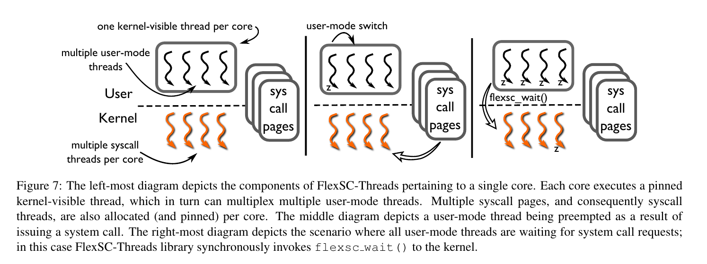

## System Call Cost

应用程序通过System Call向kernel请求服务。一般应用程序发起系统调用后，从用户态进入内核态，最后从异常退出，返回用户态。

但是这种同步的系统调用机制可能对应用的性能带来限制：

- Direct Cost: 在系统调用后，CPU会清空流水线。
- Indirect Cost: 程序的局部性以及cache可以提升性能。但是在系统调用后，要在kernel空间执行代码，这就会影响cache性能。而且在kernel处理结束返回用户后，相比与原来的cache，cache受到了污染，带来间接性能损失。

可以看到在系统调用后，IPC(**I**nstructions **P**er **C**ycle)降低。

## Exception-Less System Call

exception-less系统调用，让系统调用异步完成。在user和kernel共享一些**syscall pages**，用这些syscall page记录当前请求的系统调用。用户发起系统调用后，在syscall pages中添加新的entry后就可以返回。同时，有一些特殊的kernel thread，**syscall thread**，在syscall pages中找到请求的系统调用，把返回值写在相应的条目。最后用户就通过可以检查syscall pages，拿到返回值。

那这种将invoke和execute解耦的设计怎么做有什么好处呢？

- 可以推迟执行，把syscall按batch执行，降低mode之间转化的代价，*improve temporal locality*。
- 对于多核系统，可以把syscall放在另一个核上执行，这样就可以降低间接代价，*improved spatial locality*。

### Implementation

在实现时，作者添加两个新的系统调用，都采用同步的系统调用机制。

- `flexsc_register`，做一些syscall page的映射，并创建syscall thread，数量等于page中entry的数量。
- `flexsc_wait`，因为这种异步机制，会出现用户需要停下来等待系统调用的完成。

syscall thread的调度，会影响exception-less syscall的性能。对于单核，调用`flexsc_wait`后，调度syscall thread处理page中每个entry，如果出现阻塞，就用新的syscall thread接着处理一下个entry。多核时，one syscall thread per application and core，这样就带来了并行处理的可能。

## FlexSC Threads

但是这样异步方式，可能会让使用变得复杂，而且随着多核的发展，作者就实现了FlexSC-Threads。利用dynamic loading，系统调用时，调用一个wrapper，这样就可以让应用得到*free lunch*。

维护$M$个user-mod thread，对一个process，每个核上只有一个可以被kernel看见。发起系统调用的线程，在写好entry后，就会被切换执行一下thread。用完ready的user-mode thread，就看看syscall page上有没有完成的。如果还没有ready的，就需要调用下`flexsc_wait`。

对于这种设计，需要提高并发，来提升性能。highly threaded workloads是FlexSC-Threads的理想环境。

**Reference**

[1] Soares L, Stumm M. FlexSC: Flexible System Call Scheduling with Exception-Less System Calls[C]//Osdi. 2010, 10: 33-46.

