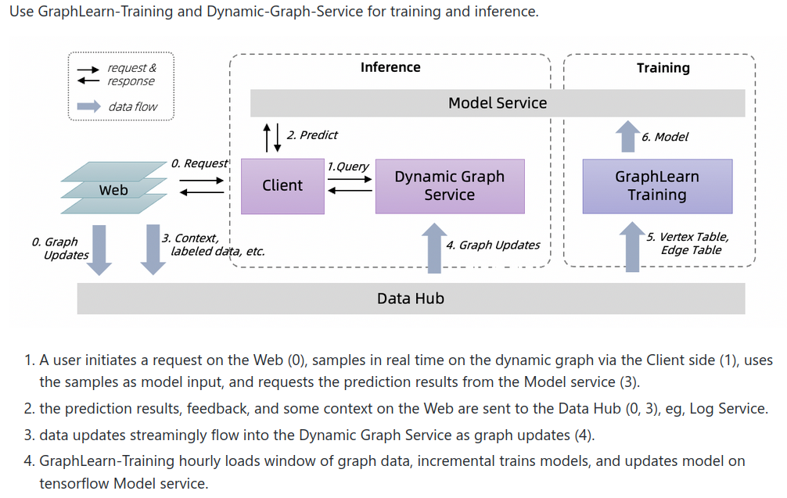
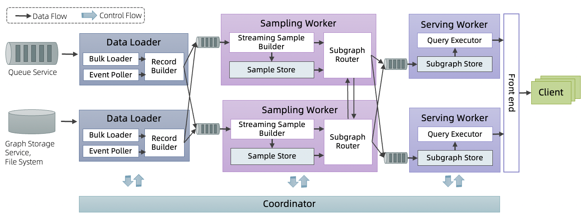
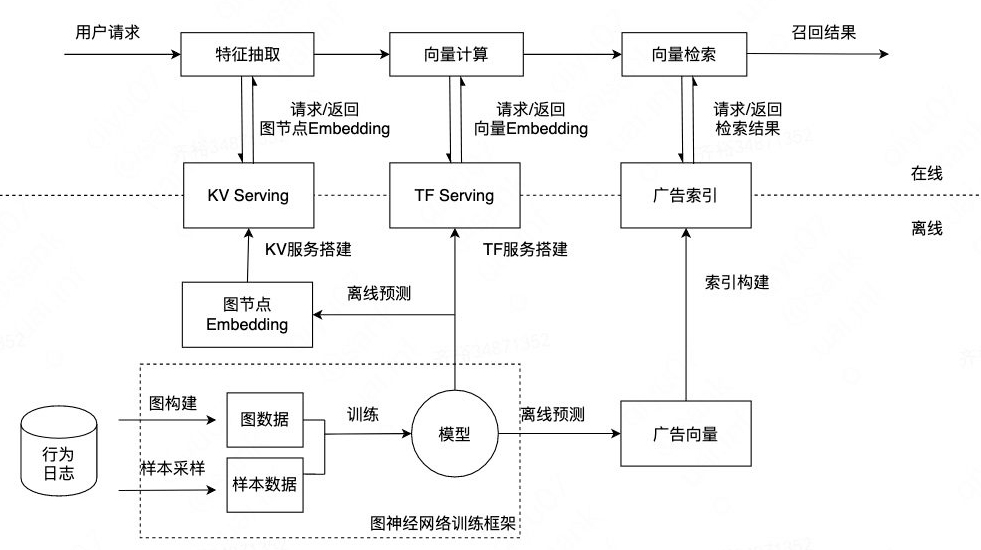

### Prelude

GNN是最近几年中机器学习较新的一个发展方向，也是学术界和工业界研究的热点话题。相比于node2vec、PageRank，GNN具有更强大的学习能力，能够更好得感知图数据。

GNN的一个经典应用场景是推荐系统。像淘宝这样的电商平台，大量的用户和商品，自然而然地形成了一个复杂异构图，一个直观想法是，可以利用GNN学习用户的兴趣特征，根据用户的历史浏览推荐用户更感兴趣的商品。而且这种方法的推荐质量也更高。

## Pinterest

### Let's begin with PinSage [^1]

GNN的开山制作——GCN [^7]把GNN训练用矩阵乘法来刻画，这样会导致一个问题，每一层每个点都要从他的邻居中读取feature (i.e. 全图训练)，导致GNN的复杂度非常高。

后来，一个点在他的部分邻居中读取feature（i.e. 图采样）就可以保证模型的准确度，这样就减低了GNN训练的成本。PinSage也是一个基于采样的GNN算法，是一个早期同时也非常经典的GNN算法。和GraphSage相比，最大的不同点在于用random-walk，采样的子图的质量会好一些。

比如上图就是一个两层的GNN, 在采样完成后我们会得到很多个子图（i.e. mini-batch）并喂给网络训练。每层网络都是如下图所示的图卷积操作，通过聚合特征（e.g. 取平均，求和）再通过一层神经网络得到一下层的输入。将多层图卷积stack到一起就构成了整个GNN，一般只有2-3层。

然而这和推荐系统有什么关系呢？在Pinterest中，有很多*pin*（类似淘宝的商品，在推荐系统中也称之为*item*），每个item会包含图片、文本信息，将图片和文本的embedding拼接到一起得到item的初始特征向量。在训练完GNN之后，通过推理得到每个item的嵌入向量，之后推荐系统就可以根据embedding向用户推荐新的item。

### Recoommandation System at Pinterest

到推荐系统中，我们会认为每个item的embeddin向量是通过一个黑箱过程（i.e. PinSage），是提前已知的 [^2]。我们的问题是，知道用户点击item历史序列$\mathcal{A}=\\{a_1, a_2, ...\\}$，我们想从$\mathcal{P}=\\{p_1, p_2, ...\\}$中预测下一个用户可能感兴趣的商品。

我们可以想到一些很直观的方法，比如历史的item求平均，还可以按时间给一个权重。但是这样的方法把用户的embedding限制在一个有限的向量里面，效果不是很好，因为一个用户兴趣面是是很广的，对不同种类的商品有不同的喜好。PinnerSage [^2] 会给用户维护一个不限大小的embedding，不同的种类的喜好都对应到一个嵌入向量。

然而还有另外一个问题——用户的历史序列会很长，计算的复杂度会非常大，影响推荐的系统的延迟。PinnerSage采用的方法是，通过聚类，每个商品都可以用一个类中心来表示。在推荐的时候，根据用户的action再给这些类中心一个重要性评分。最后用最重要的类（e.g. top 3）去预测下一个item。

总结一下PinnerSage的推荐过程分为3步：

- 用户历史动作序列聚类
- 得到类中心嵌入向量（Medoid based）

- 根据time decay计算类的重要度

找哪一个item最合适是一个索引过程，一般会通过cache加速查询。为了兼顾用户的长期兴趣和系统延迟，PinnerSage将任务分成两类，daily和online。在每天PinnerSage都会把用户的历史动作进行聚类的，得到类中心和重要度，这样可以保证和用户兴趣。而在online推荐的时候，只会对用最新的动作在已有的类上refine，降低推荐的延迟。

## AliGraph [^3]

图数据规模的增大给GNN训练带来新的挑战，在工业界，图的规模会非常大，点和边往往是billion量级的。Ali坐拥最大的电商平台之一，大规模图神经网络既有真实的场景，同时也是一个亟须解决的问题。

AliGraph是ali的一个图神经网络框架。从系统的角度来看，AliGraph需要为上层用户提供应有的支撑，使得上层算法和应用开发可以仅仅关注自身的逻辑，而不用担心资源如何分配的问题。

面对超大规模的图，AliGraph通过parition把图分布式存在集群上，解决了存储的问题。同时通过维护cache，尽可能减少partition之间的通讯开销。同时AliGraph还需要实现常见的算子来支持上层GNN应用。AliGraph也进行了开源，GraphLearn [^9]，同时支持推理和训练任务。

GNN训练基本都是大同小异，而推理任务是部署和落地中主要workload，而且大部分的计算资源也是花在推理上。考虑到真实场景下，图一般是动态（e.g. 新用户的加入），GraphLearn后来增加了Dynamic Graph Service (DGS)来支持动态图的推理任务。

整个系统通过微服务的方式运行，每个模块被拆到subservices，模块之间都通过队列连接起来（e.g. kafka）。

## 美团广告推荐[^4]

> 可以发现在和Pinterest的推荐系统其实在设计上有很多共同点。

美团在推荐任务中有两个观察点：**数据样本稀疏**，广告投放后点击量非常少；**用户兴趣存在时空特点**，在不同时间点和地点用户有不同的兴趣点。通过异构图构建、注意力机制等方法解决的推荐不准确的问题。

整个推荐也分成online任务，保证请求低延迟；以及offline任务，用来更新图节点embedding，学习用户的长期兴趣。而整个系统的部署方式和GraphLearn也有一些相似性。

## Challenges still exist 

在很多业务场景下，图并不是静态不变的而是呈现出一种时间特征，一些点在$t_0$时加入，之后在$t_1$时删除。但是时序图GNN（TGNN）仍然是一个open的问题 [^5]。在近几年GNN的发展中，开放的标准数据集（e.g. OGB [^10]）有着巨大的贡献，不论是GNN算法还是GNN系统开发，都会将OGB作为数据集和其他baseline比较。然而目前TGNN并没有对应的标准数据集，这样我们很难去比较不同来自不同团队的工作。另一个方面，GNN的收敛性和表达能力是可以被证明的，但是TGNN还是一个相对较新的算法，并没有GNN成熟，缺少基础的理论支撑。

GNN虽然网络层数少，计算资源需求不大，但是图和特征需要占用大量的存储资源，这给GNN部署和落地带来了一些挑战 [^6]。

这就产生了一个新的问题，在部署GNN时我们希望可以降低存储的开销，Serving graph compression for GNNs。Model compression、Coreset selection、 Dataset distillation是目前的一些常见的方法。

GNN如今已经在推荐系统中有了一席之地。之后，随着GNN应用逐渐扩大、GNN算法的改进、软件环境的变化，也许会产生新的设计，but no one can predict。

[^1]: [Graph Convolutional Neural Networks for Web-Scale Recommender Systems](https://dl.acm.org/doi/pdf/10.1145/3219819.3219890)
[^2]: [PinnerSage: Multi-Modal User Embedding Framework for Recommendations at Pinterest](https://dl.acm.org/doi/pdf/10.1145/3394486.3403280)
[^3]: [AliGraph: A Comprehensive Graph Neural Network Platform](https://dl.acm.org/doi/pdf/10.14778/3352063.3352127)
[^4]: [大规模异构图召回在美团到店推荐广告的应用](https://tech.meituan.com/2022/11/24/application-of-large-scale-heterogeneous-graph-in-meituan-recommended-ads.html)
[^5]: [Graph Neural Networks for temporal graphs: State of the art, open challenges, and opportunities](https://arxiv.org/pdf/2302.01018.pdf)
[^6]: [Serving Graph Compression for Graph Neural Networks](https://openreview.net/pdf?id=T-qVtA3pAxG)
[^7]: [SEMI-SUPERVISED CLASSIFICATION WITH GRAPH CONVOLUTIONAL NETWORKS](https://arxiv.org/pdf/1609.02907.pdf)
[^8]: [Inductive Representation Learning on Large Graphs](https://arxiv.org/pdf/1706.02216.pdf)
[^9]: [GraphLearn](https://github.com/alibaba/graph-learn)
[^10]: [Open Graph Benchmark: Datasets for Machine Learning on Graphs](https://arxiv.org/abs/2005.00687)

