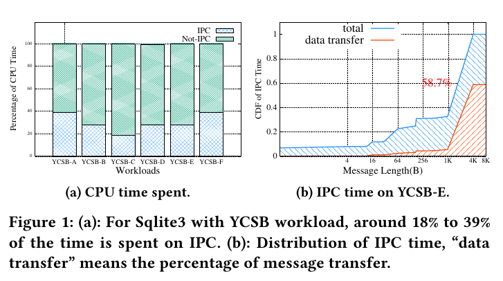
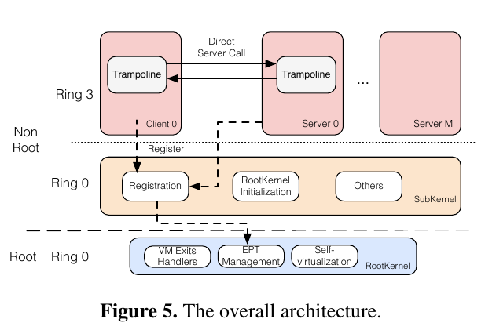
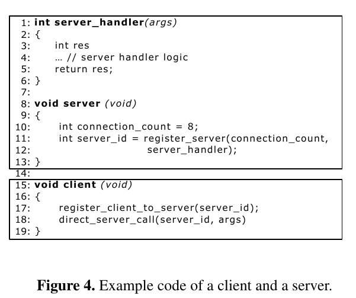
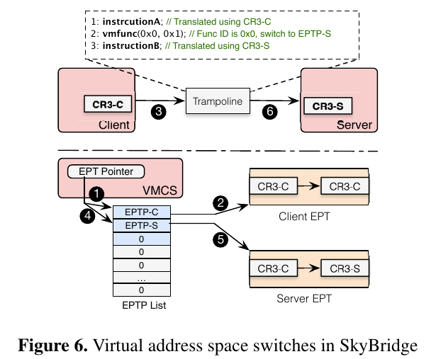
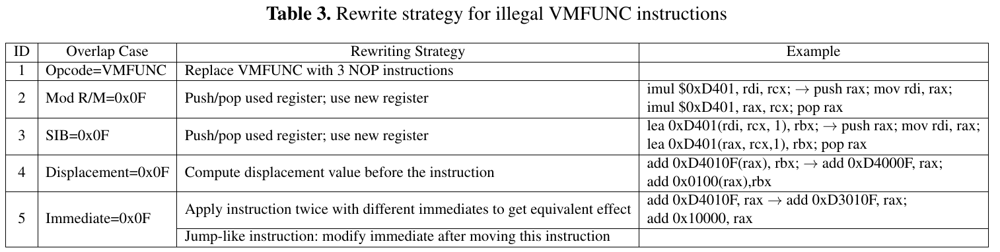
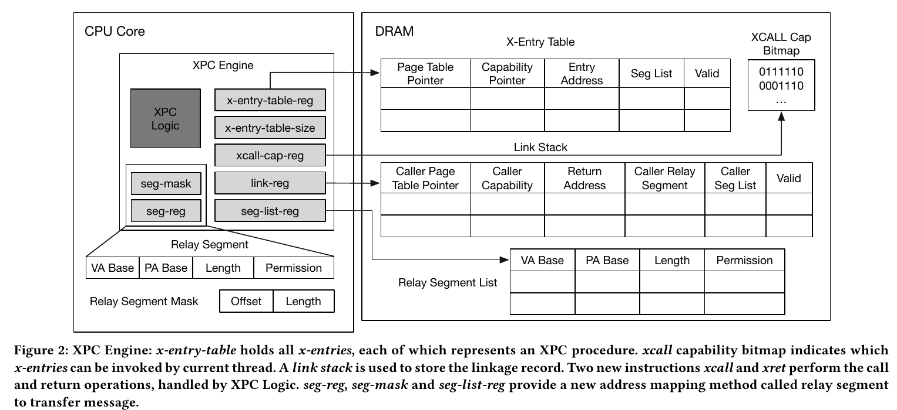
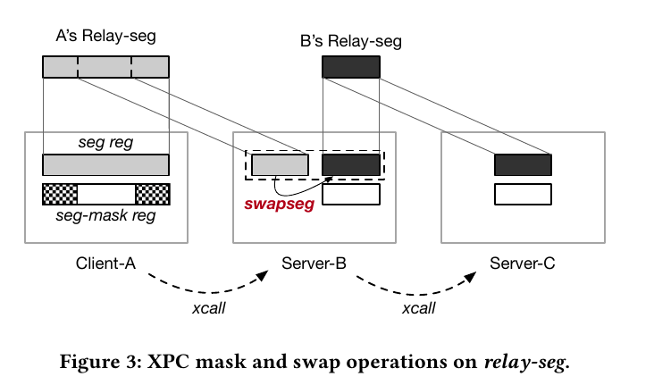

## Inter-Process Communication

微内核相比与宏内核，具有更好的扩展性、安全性，也能够更好地容忍错误。但是微内核只保留很基本的功能，很多服务都作为一个用户进程存在，进程之间大量使用IPC传递消息。

另外在宏内核中也会经常使用IPC，如Android Binder。

## Optimize synchronous IPC

一般IPC过程需要经过内核，这个过程需要保存用户态状态，当退出内核时还需恢复用户状态。因为每个进程都在自己的虚拟地址空间中，IPC过程还需要切换虚拟地址空间。另外还有一些逻辑需要处理。这些都导致IPC有较高的延迟。

> [seL4](https://sel4.systems/)用fastpath降低IPC延迟，消息会被立即发送，让kernel直接切换到server进程避免了调度器，因此可以提升IPC性能。但是也无法避免kernel。

另一方面当传递的消息较大时，IPC一般需要将消息复制到内核，再从内核复制到另一个进程。或者使用共享内存，减少一次复制。

在seL4上测试负载，IPC占用的时间是很多的。

## SkyBridge

为了提高IPC性能，SkyBridge想法是IPC不经过kernel,sender可以直接调用receiver的procedure。不进过kernel如何调用receiver呢？似乎需要一个新的模块完成这个功能，SkyBridge利用Intel为虚拟化提供的硬件，**EPT(extended page table)** 切换，允许在用户态下切换EPT，这样就可以实现在用户态下切换虚拟地址空间。

但是为了利用EPT切换，就需要在增加一个hypervisor。（有可能会影响性能）

> 在虚拟机中运行的进程，如果要访问内存会经过
>
> GVA(Guest virtual address)➡GPA(Guest physical address)➡HPA(Host physical address)
>
> 这样的两级地址转换，经过Guest页表得到GPA，再经过EPT得到HPA

同时SkyBridge中的每个进程都在自己的虚拟空间中，彼此之间相互隔离。如果通过将进程放在同一个虚拟空间，然后用EPT将他们隔离，这样的话当进程数很多的时候就会比较复杂。

从上图可以看到SkyBridge的两个kernel：`RootKernel`( a tiny hypervisor)和`SubKernel`(即microkernel)。

首先server在kernel中注册。kernel会吧trapoline-related代码和数据映射到server的虚拟空间，并返回一个ID用来给client调用。client向kernel注册时提供1server ID,kernel同样将代码和数据映射到他的虚拟空间。

Subkernel调用Rootkernel的借口让server和client在EPT level上绑定，kernel会为client和server配置EPT。配置server的EPT时，SkyBridge把client的页表映射到相应server的页表。client调用`direct_server_call`，切换至server的EPT后使用server的页表翻译后续的地址。trapoline代码安装server的stack,调用handler。

在执行过程中，client的CR3(页表地址)不会发生改变，SkyBridge将client CR3的HPA映射为server C3的HPA，这样就相当于切换到了server的空间。

### something else

**RootKernel & 虚拟化开销**，Rootkernel只提供最基本的功能，同时为了降低VM exit，Rootkernel允许像更改CR3的指令不触发VM exit、让外部中断直接到microkernel处理。为了解决EPT violation，Rootkernel用1GB的页，把大部分host物理内存映射到microkernel（除了Rootkernel保留的部分，大概100MB）。这样microkernel访问物理地址时，就不会有EPT iolation。这样不仅降低了处理TLB miss的时间，也降低了TLS miss的次数。

**illegal VMFUNC**，可能会导致一些安全问题。SkyBrdige的方法是功能相同的指令替换之前的指令。

## XPC

但是SkyBridge需要工作在虚拟化环境中，而且当出现调用链的时候（e.g., A$\rightarrow$B$\rightarrow$C）这样出现消息被多次复制的情况。

XPC从两个方面提高IPC性能，

- 让IPC不经过kernel
- 不复制传递消息

和SkyBridge一样XPC也属于硬件优化IPC，SkyBridge通过VMFUNC, XPC则通过在新的硬件，XPC engine。XPC engine提供了IPC的基本功能，如capability检查、上下文切换、高效轻量级的消息传递机制(relay-seg)。

XPC engine提供了两个硬件原语：**User-level Cross Process Call**，**Lightweight Message Transfer**

### Cross Procss Call

**x-entry**, 和其他进程的procedure绑定。每个进程可以创建多个`x-entry`,所有的`x-entry`都存在`x-entry-table`（`x-entry-table-reg`指向的一个全局内存空间）中。通过`x-entry-table-size`控制`x-entry-table`的大小。`xcall-cap`(XPC call capability)记录每个entry的capability。

**link stack & linkage record**, `linkage record`用来维护调用时的信息，存在`link stack`中。`link stack`是存在`link-reg`指向的进程内存中。可以考虑使用非阻塞的方法优化压栈，减少延迟。

**x-call**, 用来调在用一个x-entry。XPC engine去检查caller的`xcall-cap`、加载`x-entry`并检查、在`link stack`中压入`linkage record`、加载新的页表指针。

**x-reg**, 从`link stack`中弹出一个record,返回之前的进程。CPU会首先检查`linkage record`中的有效位，然后恢复caller。

**XPC Engine Cache**, 可以用cache优化XPC engine取`x-entry`和capability。因为对单线程IPC具有高局部性、IPC是可预测的。

### Relay Segment

**relay-seg**, 有四个字段，虚地址基址、物理地址基址、长度、权限。地址翻译时，`seg-reg`的比页表有更高的优先级。

**seg-mask**, 虽然不能改变`seg-reg`的映射，但是可以通过`seg-mask`缩小relay-seg

**seg-list-reg**, 存放`seg-reg`的列表，存放在进程内存。一个进程可以创建多个`relay-seg`。可以通过`swapseg #reg`切换`seg-reg`

每个时刻每个`relay-seg`只能有一个线程所有，同一个时刻只能有一个核对`relay-reg`进行操作，不然有会导致TOCTTOC攻击。

在`x-ret`时，`seg-reg`需要和调用时一样，因为有可能恶意的程序会去修改`seg-reg`。

**Reference**

[1] Mi, Zeyu, et al. "Skybridge: Fast and secure inter-process communication for microkernels." *Proceedings of the Fourteenth EuroSys Conference 2019*. 2019.

[2] Du, Dong, et al. "Xpc: Architectural support for secure and efficient cross process call." *Proceedings of the 46th International Symposium on Computer Architecture*. 2019.

[3] [KVM硬件辅助虚拟化之 EPT(Extended Page Table)](https://royhunter.github.io/2014/06/18/KVM-EPT/)
